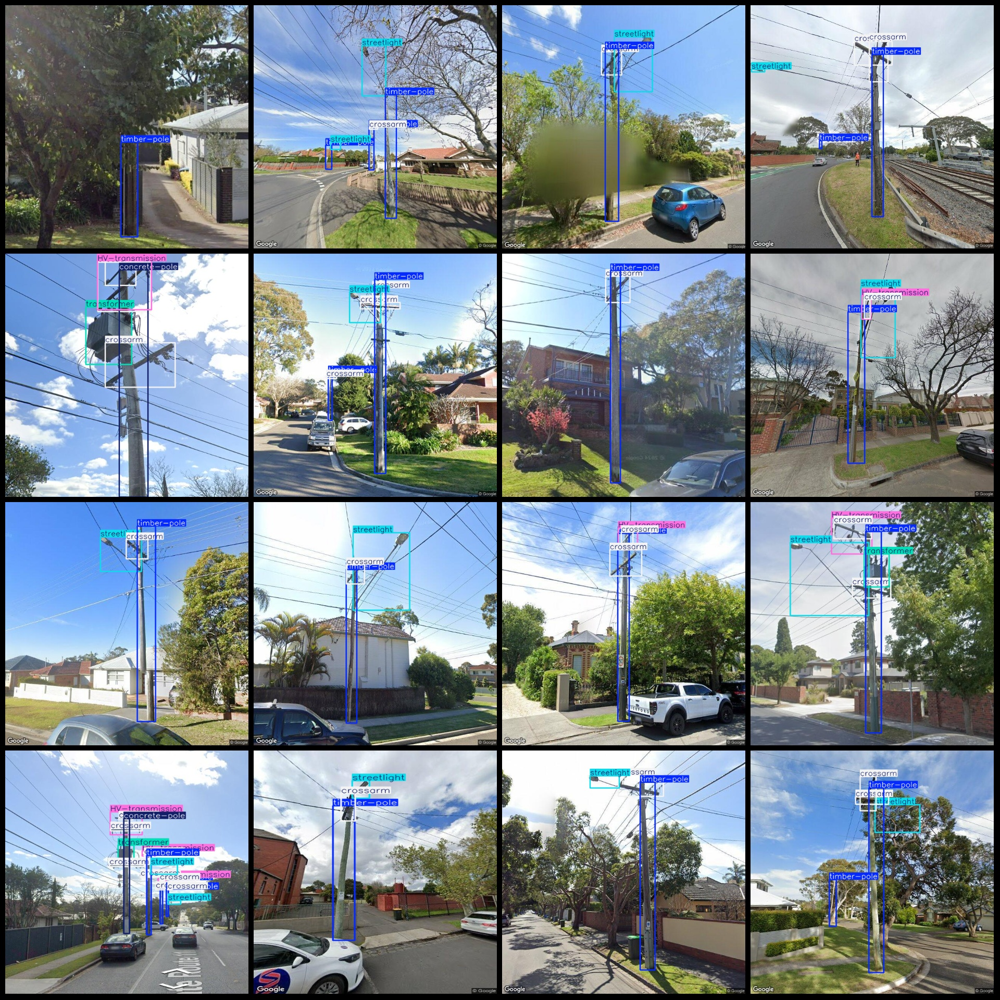
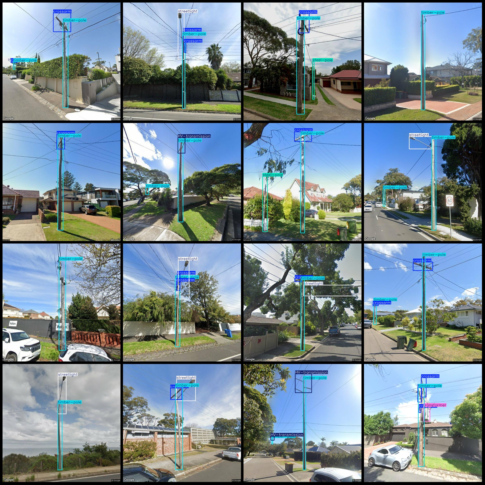

# Dataset of Traffic Road Electrical Facilities Elements: High Voltage Switches, Poles, Street Lights, Transformers, Detected in VOC+YOLO Format with 4466 Images and 9 Categories

dataset format: Pascal VOC format+YOLO format
number of images: 4466  
annotation count: 4466  
annotation count: 4466  
annotationnumber of classes: 9  
Repository: firc-dataset
Annotation class names (Note that the order of YOLO format classes does not correspond to this, but is based on the labels folder's classes.txt): ["HV-switch", "HV-transmission", "concrete-pole", "crossarm", "steel-pole", "streetlight", "timber-pole", "traffic-light", "transformer"]
boxes per class:   
HV-switch box count = 185
HV-transmission box count = 1644
concrete-pole box count = 285
crossarm box count = 7036
steel-pole box count = 1090
streetlight box count = 3224
timber-pole box count = 5893
Traffic light frame count = 408
Transformer blocks have 318 units.
total boxes: 20083  
image resolution: 640x640  
Is there any enhancement to the dataset: Yes, about half of it is original images, and the rest are enhanced images, mainly by changing the brightness.
Using the annotation tool: labelImg
Annotation rule: Drawing a rectangle around the class
Important notes: None
Special Disclaimer: This dataset does not guarantee the accuracy of models or weight files trained on it.
Preview:
## Images

Here is a pay link on Stripe ( https://buy.stripe.com/3cs8yP7sY87d0vu9AB ). Please contact me lonlonago@foxmail.com after funding $89, and I will send you a complete data files , thank you!

